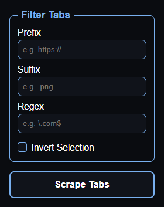

# TabScraper

<!-- -->

## Description
**TabScraper** is a lightweight Chrome extension that lets you export URLs of all your currently open browser tabs into a downloadable text file. You can filter the tabs by prefix, suffix, or regex to customize which URLs get saved.

## Features

- Export all open tab URLs with one click.
- Filter tabs by URL prefix, suffix, or regular expression.
- Save your filter preferences locally for convenience.
- Privacy-first: all data processing happens locally in your browser.
- Dark mode and modern UI with rounded corners.

## Installation

### From source (for development)

1. Clone this repository:

   ```bash
   git clone https://github.com/yourusername/TabScraper.git
   cd TabScraper

2. Install dependencies:

   ```bash
   npm install
   ```

3. Build the TypeScript files:

   ```bash
   npm run build
   ```

4. Load the extension in Chrome:
- Open `chrome://extensions/`
- Enable Developer mode (top right)
- Click Load unpacked and select the `dist` folder inside your project

## Usage
1. Click the TabScraper icon in the Chrome toolbar.
2. Set your filters (prefix, suffix, regex) as desired.
3. Click Scrape to generate a text file (`tabs.txt`) with matching tab URLs.
4. The file will be downloaded to your default downloads folder.

---

## Permissions
- **tabs:** To read URLs of open tabs.
- **downloads:** To save the scraped URLs as a text file.
- **storage:** To save your filter settings locally.

## Privacy
TabScraper does not collect or transmit any data. All operations are performed locally in your browser.

## Contributing
Contributions and suggestions are welcome! Feel free to open issues or pull requests.